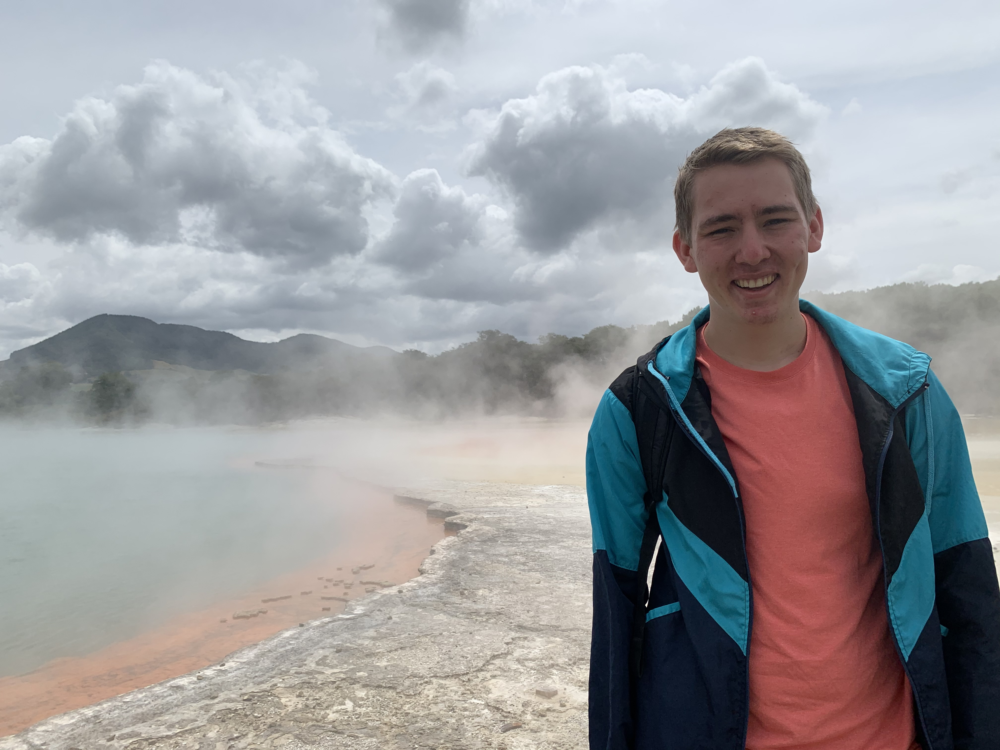

## About Me
 I am a third year graduate student in the Mathematics Department at the [University of Washington, Seattle](https://math.washington.edu/). I'm currently interested in entropic regularized optimal transport and its connections to machine learning. More broadly, I am interested in all things probability, optimization, and machine learning (particularly reinforcement learning and language models). 

I did my undergraduate studies in Mathematics and Statistics at [Purdue University](https://www.math.purdue.edu/), where I had the good fortune of being mentored by Prof. Thomas Sinclair and Prof. Mark Ward. 

I have interned at [Lawrence Livermore National Laboratory](https://data-science.llnl.gov/dssi) in the summers of 2021 and 2023, where I was mentored by Mikel Landajuela in projects involving reinforcement learning, language models, and symbolic regression.
In the summer of 2020, I interned at [Sandia National Laboratories](https://www.sandia.gov/) where I was mentored by Dusty Brooks and Brian Ehrhart in a project applying Bayesian statistical methods to estimate leak frequencies. 

## Publications, Conference Papers, and Technical Reports
- M. Landajuela, C. Shing Lee, J. Yang, R. Glatt, C. Santiago, T. N. Mundhenk, I. Aravena, **G. Mulcahy**, B. K. Petersen, [*A unified framework for deep symbolic regression*](https://openreview.net/forum?id=2FNnBhwJsHK). Thirty-sixth Conference on Neural Information Processing Systems, 2022, NeurIPS 2022.
- **Mulcahy, G.** & Sinclair T., [*Malnormal matrices*](https://arxiv.org/abs/2009.11139), Proc. Amer. Math. Soc. 150 (2022), no. 7, 2969-2982
- **Mulcahy, G.**, Brooks, D.M., Ehrhart, B, [*Using Bayesian methodology to estimate liquefied natural gas leak frequencies*](https://www.osti.gov/biblio/1782412), Sandia National Laboratories, Albuquerque, New Mexico, 2021, SAND2021-4905. 
- **Mulcahy, G.**, Atwood, B., & Kuznetsov, A. (2020). [*Basal ganglia role in learning rewarded actions and executing previously learned choices: Healthy and diseased states*](https://journals.plos.org/plosone/article?id=10.1371/journal.pone.0228081). PLOS ONE 15(2): e0228081. https://doi.org/10.1371/journal.pone.0228081

## Contact Information
My email is gmulcahy @ uw . edu.

If you were expecting information about Ancient Mediterranean religions, you have the wrong Mulcahy. My sister [Ciara](https://religion.unc.edu/_people/graduate-students/) is a graduate student in religious studies at UNC Chapel Hill. 
